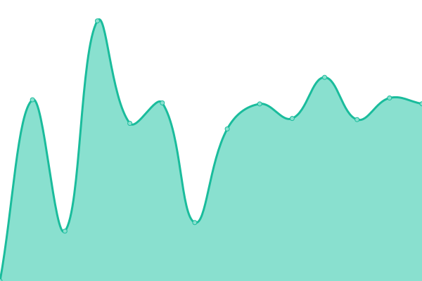

# [📈 Live Status](https://joahn3.github.io/upptime2): <!--live status--> **🟧 Partial outage**

This repository contains the open-source uptime monitor and status page for [Ionuț Francisc](https://joahn3.github.io/upptime2), powered by [Upptime](https://github.com/upptime/upptime).

With [Upptime](https://upptime.js.org), you can get your own unlimited and free uptime monitor and status page, powered entirely by a GitHub repository. We use [Issues](https://github.com/joahn3/upptime2/issues) as incident reports, [Actions](https://github.com/joahn3/upptime2/actions) as uptime monitors, and [Pages](https://joahn3.github.io/upptime2) for the status page.

<!--start: status pages-->
<!-- This summary is generated by Upptime (https://github.com/upptime/upptime) -->
<!-- Do not edit this manually, your changes will be overwritten -->
<!-- prettier-ignore -->
| URL | Status | History | Response Time | Uptime |
| --- | ------ | ------- | ------------- | ------ |
|  [firaCODE.ro](https://firacode.ro) | 🟩 Up | [fira-code-ro.yml](https://github.com/joahn3/upptime2/commits/HEAD/history/fira-code-ro.yml) | 

 677ms
     
 | 

<a href="https://joahn3.github.io/upptime2/history/fira-code-ro">100.00%</a>
    

|  [firaWEB.ro](https://firaweb.ro) | 🟩 Up | [fira-web-ro.yml](https://github.com/joahn3/upptime2/commits/HEAD/history/fira-web-ro.yml) | 

 27ms
     
 | 

<a href="https://joahn3.github.io/upptime2/history/fira-web-ro">100.00%</a>
    

|  [TemeJoc.ro](https://temejoc.ro) | 🟩 Up | [teme-joc-ro.yml](https://github.com/joahn3/upptime2/commits/HEAD/history/teme-joc-ro.yml) | 

 1482ms
     
 | 

<a href="https://joahn3.github.io/upptime2/history/teme-joc-ro">99.04%</a>
    

|  [ChicRoumaine.com](https://www.chicroumaine.com) | 🟩 Up | [chic-roumaine-com.yml](https://github.com/joahn3/upptime2/commits/HEAD/history/chic-roumaine-com.yml) | 

 3601ms
     
 | 

<a href="https://joahn3.github.io/upptime2/history/chic-roumaine-com">99.04%</a>
    

|  [Tsty](https://tsty.ro) | 🟩 Up | [tsty.yml](https://github.com/joahn3/upptime2/commits/HEAD/history/tsty.yml) | 

 2554ms
     
 | 

<a href="https://joahn3.github.io/upptime2/history/tsty">100.00%</a>
    

|  [GoodPC.ro](https://goodpc.ro) | 🟩 Up | [good-pc-ro.yml](https://github.com/joahn3/upptime2/commits/HEAD/history/good-pc-ro.yml) | 

 410ms
     
 | 

<a href="https://joahn3.github.io/upptime2/history/good-pc-ro">100.00%</a>
    

|  [Notariat Sector 4](https://notarsector4.ro) | 🟥 Down | [notariat-sector-4.yml](https://github.com/joahn3/upptime2/commits/HEAD/history/notariat-sector-4.yml) | 

 0ms
     
 | 

<a href="https://joahn3.github.io/upptime2/history/notariat-sector-4">0.00%</a>
    

|  [Notariat Sector 4 <Google version>](https://sites.google.com/view/notariatonline-ro) | 🟩 Up | [notariat-sector-4-google-version.yml](https://github.com/joahn3/upptime2/commits/HEAD/history/notariat-sector-4-google-version.yml) | 

 236ms
     
 | 

<a href="https://joahn3.github.io/upptime2/history/notariat-sector-4-google-version">100.00%</a>
    

|  [Zametu](https://zametu.ro) | 🟥 Down | [zametu.yml](https://github.com/joahn3/upptime2/commits/HEAD/history/zametu.yml) | 

 0ms
     
 | 

<a href="https://joahn3.github.io/upptime2/history/zametu">0.00%</a>
    

|  [consilierJuridicOnline.ro](https://consilierjuridiconline.ro) | 🟥 Down | [consilier-juridic-online-ro.yml](https://github.com/joahn3/upptime2/commits/HEAD/history/consilier-juridic-online-ro.yml) | 

 0ms
     
 | 

<a href="https://joahn3.github.io/upptime2/history/consilier-juridic-online-ro">0.00%</a>
    

|  [Parental Control Romania](https://parentalcontrol.ro) | 🟥 Down | [parental-control-romania.yml](https://github.com/joahn3/upptime2/commits/HEAD/history/parental-control-romania.yml) | 

 0ms
     
 | 

<a href="https://joahn3.github.io/upptime2/history/parental-control-romania">0.00%</a>
    

|  [WeSecureWeb.dev](https://wesecureweb.dev) | 🟥 Down | [we-secure-web-dev.yml](https://github.com/joahn3/upptime2/commits/HEAD/history/we-secure-web-dev.yml) | 

 0ms
     
 | 

<a href="https://joahn3.github.io/upptime2/history/we-secure-web-dev">0.00%</a>
    

|  [Restaurant La Sulea](https://la-sulea.business.site) | 🟥 Down | [restaurant-la-sulea.yml](https://github.com/joahn3/upptime2/commits/HEAD/history/restaurant-la-sulea.yml) | 

 249ms
     
 | 

<a href="https://joahn3.github.io/upptime2/history/restaurant-la-sulea">0.00%</a>
    

|  [Profesor Floriana Pliundra](https://floriana-pliundra-website.vercel.app) | 🟩 Up | [profesor-floriana-pliundra.yml](https://github.com/joahn3/upptime2/commits/HEAD/history/profesor-floriana-pliundra.yml) | 

 102ms
     
 | 

<a href="https://joahn3.github.io/upptime2/history/profesor-floriana-pliundra">100.00%</a>
    

|  [ionutFrancisc.com (Netlify Dev version)](https://ionut-francisc.netlify.app) | 🟩 Up | [ionut-francisc-com-netlify-dev-version.yml](https://github.com/joahn3/upptime2/commits/HEAD/history/ionut-francisc-com-netlify-dev-version.yml) | 

 301ms
     
 | 

<a href="https://joahn3.github.io/upptime2/history/ionut-francisc-com-netlify-dev-version">100.00%</a>
    

|  [BOLDmodels.ro](https://boldmodels.ro) | 🟩 Up | [bol-dmodels-ro.yml](https://github.com/joahn3/upptime2/commits/HEAD/history/bol-dmodels-ro.yml) | 

 3896ms
     
 | 

<a href="https://joahn3.github.io/upptime2/history/bol-dmodels-ro">98.70%</a>
    

|  [Security & Telecom Systems](https://security-telecom.ro) | 🟩 Up | [security-and-telecom-systems.yml](https://github.com/joahn3/upptime2/commits/HEAD/history/security-and-telecom-systems.yml) | 

 2379ms
     
 | 

<a href="https://joahn3.github.io/upptime2/history/security-and-telecom-systems">99.03%</a>
    

|  [new | Security & Telecom Systems](https://security-telecom.netlify.app) | 🟩 Up | [new-security-and-telecom-systems.yml](https://github.com/joahn3/upptime2/commits/HEAD/history/new-security-and-telecom-systems.yml) | 

 263ms
     
 | 

<a href="https://joahn3.github.io/upptime2/history/new-security-and-telecom-systems">100.00%</a>
    

|  [BaffiCafe.ro](https://bafficafe.ro) | 🟩 Up | [baffi-cafe-ro.yml](https://github.com/joahn3/upptime2/commits/HEAD/history/baffi-cafe-ro.yml) | 

 1430ms
     
 | 

<a href="https://joahn3.github.io/upptime2/history/baffi-cafe-ro">99.03%</a>
    

|  [Firacode clients uptime monitoring](https://joahn3.github.io/upptime2/) | 🟩 Up | [firacode-clients-uptime-monitoring.yml](https://github.com/joahn3/upptime2/commits/HEAD/history/firacode-clients-uptime-monitoring.yml) | 

 170ms
     
 | 

<a href="https://joahn3.github.io/upptime2/history/firacode-clients-uptime-monitoring">100.00%</a>
    

|  [earthlink uptime monitoring](https://joahn3.github.io/earthlink-uptime/) | 🟩 Up | [earthlink-uptime-monitoring.yml](https://github.com/joahn3/upptime2/commits/HEAD/history/earthlink-uptime-monitoring.yml) | 

 76ms
     
 | 

<a href="https://joahn3.github.io/upptime2/history/earthlink-uptime-monitoring">100.00%</a>
    

<!--end: status pages-->

[**Visit our status website →**](https://joahn3.github.io/upptime2)

## 📄 License

- Powered by: [Upptime](https://github.com/upptime/upptime)
- Code: [MIT](./LICENSE) © [Ionuț Francisc](https://joahn3.github.io/upptime2)
- Data in the `./history` directory: [Open Database License](https://opendatacommons.org/licenses/odbl/1-0/)
