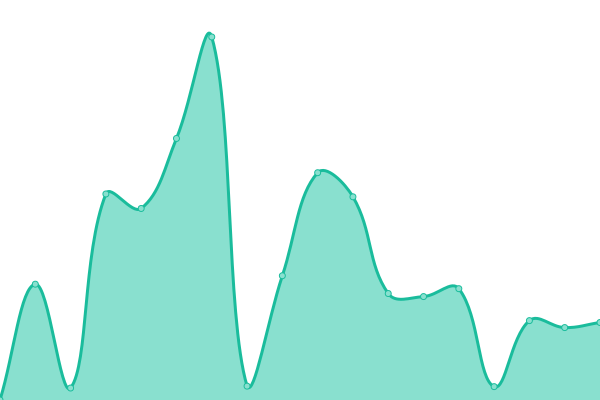

# [📈 Live Status](https://joahn3.github.io/upptime2): <!--live status--> **🟩 All systems operational**

This repository contains the open-source uptime monitor and status page for [Ionuț Francisc](https://joahn3.github.io/upptime2), powered by [Upptime](https://github.com/upptime/upptime).

With [Upptime](https://upptime.js.org), you can get your own unlimited and free uptime monitor and status page, powered entirely by a GitHub repository. We use [Issues](https://github.com/joahn3/upptime2/issues) as incident reports, [Actions](https://github.com/joahn3/upptime2/actions) as uptime monitors, and [Pages](https://joahn3.github.io/upptime2) for the status page.

<!--start: status pages-->
<!-- This summary is generated by Upptime (https://github.com/upptime/upptime) -->
<!-- Do not edit this manually, your changes will be overwritten -->
<!-- prettier-ignore -->
| URL | Status | History | Response Time | Uptime |
| --- | ------ | ------- | ------------- | ------ |
|  [Chic Roumaine](https://www.chicroumaine.com) | 🟩 Up | [chic-roumaine.yml](https://github.com/joahn3/upptime2/commits/HEAD/history/chic-roumaine.yml) | 

 3333ms
     
 | 

<a href="https://joahn3.github.io/upptime2/history/chic-roumaine">100.00%</a>
    

|  [Earthlink.ro](https://earthlink.ro) | 🟩 Up | [earthlink-ro.yml](https://github.com/joahn3/upptime2/commits/HEAD/history/earthlink-ro.yml) | 

 1054ms
     
 | 

<a href="https://joahn3.github.io/upptime2/history/earthlink-ro">100.00%</a>
    

|  [GoodPC.ro](https://goodpc.ro) | 🟩 Up | [good-pc-ro.yml](https://github.com/joahn3/upptime2/commits/HEAD/history/good-pc-ro.yml) | 

 3132ms
     
 | 

<a href="https://joahn3.github.io/upptime2/history/good-pc-ro">100.00%</a>
    

|  [Anahicont](https://anahicont.ro) | 🟩 Up | [anahicont.yml](https://github.com/joahn3/upptime2/commits/HEAD/history/anahicont.yml) | 

 1866ms
     
 | 

<a href="https://joahn3.github.io/upptime2/history/anahicont">100.00%</a>
    

<!--end: status pages-->

[**Visit our status website →**](https://joahn3.github.io/upptime2)

## 📄 License

- Powered by: [Upptime](https://github.com/upptime/upptime)
- Code: [MIT](./LICENSE) © [Ionuț Francisc](https://joahn3.github.io/upptime2)
- Data in the `./history` directory: [Open Database License](https://opendatacommons.org/licenses/odbl/1-0/)
